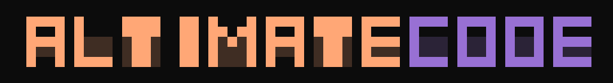

<div align="center">

<picture>
  <source media="(prefers-color-scheme: dark)" srcset="docs/docs/assets/images/altimate-code-banner.png" />
  
</picture>

**The open-source data engineering harness.**

The intelligence layer for data engineering AI — 100+ deterministic tools for SQL analysis,
column-level lineage, dbt, FinOps, and warehouse connectivity across every major cloud platform.

Run standalone in your terminal, embed underneath Claude Code or Codex, or integrate
into CI pipelines and orchestration DAGs. Precision data tooling for any LLM.

[](https://www.npmjs.com/package/altimate-code)
[](./LICENSE)
[](https://altimate.studio/join-agentic-data-engineering-slack)
[](https://docs.altimate.sh)

</div>

---

## Install

```bash
# npm (recommended)
npm install -g altimate-code

# Homebrew
brew install AltimateAI/tap/altimate-code
```

Then — in order:

**Step 1: Configure your LLM provider** (required before anything works):
```bash
altimate        # Launch the TUI
/connect        # Interactive setup — choose your provider and enter your API key
```

Or set an environment variable directly:
```bash
export ANTHROPIC_API_KEY=your_key   # Anthropic Claude
export OPENAI_API_KEY=your_key      # OpenAI
```

**Step 2 (optional): Auto-detect your data stack** (read-only, safe for production connections):
```bash
altimate /discover
```

`/discover` auto-detects dbt projects, warehouse connections (from `~/.dbt/profiles.yml`, Docker, environment variables), and installed tools (dbt, sqlfluff, airflow, dagster, and more). Skip this and start building — you can always run it later.

> **Headless / scripted usage:** `altimate --yolo` auto-approves all permission prompts. Not recommended with live warehouse connections.

> **Zero additional setup.** One command install.

## Why a specialized harness?

General AI coding agents can edit SQL files. They cannot *understand* your data stack.
altimate gives any LLM a deterministic data engineering intelligence layer —
no hallucinated SQL advice, no guessing at schema, no missed PII.

| Capability | General coding agents | altimate |
|---|---|---|
| SQL anti-pattern detection | None | 19 rules, confidence-scored |
| Column-level lineage | None | Automatic from SQL, any dialect |
| Schema-aware autocomplete | None | Live-indexed warehouse metadata |
| Cross-dialect SQL translation | None | Snowflake ↔ BigQuery ↔ Databricks ↔ Redshift |
| FinOps & cost analysis | None | Credits, expensive queries, right-sizing |
| PII detection | None | 30+ regex patterns, 15 categories |
| dbt integration | Basic file editing | Manifest parsing, test gen, model scaffolding, lineage |
| Data visualization | None | Auto-generated charts from SQL results |
| Observability | None | Local-first tracing of AI sessions and tool calls |

> **Benchmarked precision:** 100% F1 on SQL anti-pattern detection (1,077 queries, 19 rules, 0 false positives).
> 100% edge-match on column-level lineage (500 queries, 13 categories).
> [See methodology →](experiments/BENCHMARKS.md)

**What the harness provides:**
- **SQL Intelligence Engine** — deterministic SQL parsing and analysis (not LLM pattern matching). 19 rules, 100% F1, 0 false positives. Built for data engineers who've been burned by hallucinated SQL advice.
- **Column-Level Lineage** — automatic extraction from SQL across dialects. 100% edge-match on 500 benchmark queries.
- **Live Warehouse Intelligence** — indexed schemas, query history, and cost data from your actual warehouse. Not guesses.
- **dbt Native** — manifest parsing, test generation, model scaffolding, medallion patterns, impact analysis
- **FinOps** — credit consumption, expensive query detection, warehouse right-sizing, idle resource cleanup
- **PII Detection** — 15 categories, 30+ regex patterns, enforced pre-execution

**Works seamlessly with Claude Code and Codex.** Use `/configure-claude` or `/configure-codex` to set up integration in one step. altimate is the data engineering tool layer — use it standalone in your terminal, or mount it as the harness underneath whatever AI agent you already run. The two are complementary.

altimate is a fork of [OpenCode](https://github.com/anomalyco/opencode) rebuilt for data teams. Model-agnostic — bring your own LLM or run locally with Ollama.

## Quick demo

```bash
# Auto-detect your data stack (dbt projects, warehouse connections, installed tools)
> /discover

# Analyze a query for anti-patterns and optimization opportunities
> Analyze this query for issues: SELECT * FROM orders JOIN customers ON orders.id = customers.order_id

# Translate SQL across dialects
> /sql-translate this Snowflake query to BigQuery: SELECT DATEADD(day, 7, current_date())

# Generate dbt tests for a model
> /generate-tests for models/staging/stg_orders.sql

# Get a cost report for your Snowflake account
> /cost-report
```

## Key Features

All features are deterministic — they parse, trace, and measure. Not LLM pattern matching.

### SQL Anti-Pattern Detection
19 rules with confidence scoring — catches SELECT *, cartesian joins, non-sargable predicates, correlated subqueries, and more. **100% accuracy** on 1,077 benchmark queries.

### Column-Level Lineage
Automatic lineage extraction from SQL. Trace any column back through joins, CTEs, and subqueries to its source. Works standalone or with dbt manifests for project-wide lineage. **100% edge match** on 500 benchmark queries.

### FinOps & Cost Analysis
Credit analysis, expensive query detection, warehouse right-sizing, unused resource cleanup, and RBAC auditing.

### Cross-Dialect Translation
Transpile SQL between Snowflake, BigQuery, Databricks, Redshift, PostgreSQL, MySQL, SQL Server, and DuckDB.

### PII Detection & Safety
Automatic column scanning for PII across 15 categories with 30+ regex patterns. Safety checks and policy enforcement before query execution.

### dbt Native
Manifest parsing, test generation, model scaffolding, incremental model detection, and lineage-aware refactoring. 12 purpose-built skills including medallion patterns, yaml config generation, and dbt docs.

### Data Visualization
Interactive charts and dashboards from SQL results. The data-viz skill generates publication-ready visualizations with automatic chart type selection based on your data.

### Local-First Tracing
Built-in observability for AI interactions — trace tool calls, token usage, and session activity locally. No external services required. View traces with `altimate trace`.

### AI Teammate Training
Teach your AI teammate project-specific patterns, naming conventions, and best practices. The training system learns from examples and applies rules automatically across sessions.

## Agent Modes

Each mode has scoped permissions, tool access, and SQL write-access control.

| Mode | Role | Access |
|---|---|---|
| **Builder** | Create dbt models, SQL pipelines, and data transformations | Full read/write (write SQL prompts for approval; `DROP DATABASE`/`DROP SCHEMA`/`TRUNCATE` hard-blocked) |
| **Analyst** | Explore data, run SELECT queries, FinOps analysis, and generate insights | Read-only enforced (SELECT only, no file writes) |
| **Plan** | Outline an approach before acting | Minimal (read files only, no SQL or bash) |

> **New to altimate?** Start with **Analyst mode** — it's read-only and safe to run against production connections. Need specialized workflows (validation, migration, research)? Create [custom agent modes](https://docs.altimate.sh).

## Supported Warehouses

Snowflake · BigQuery · Databricks · PostgreSQL · Redshift · DuckDB · MySQL · SQL Server · Oracle · SQLite

First-class support with schema indexing, query execution, and metadata introspection. SSH tunneling available for secure connections.

## Works with Any LLM

Model-agnostic — bring your own provider or run locally.

Anthropic · OpenAI · Google Gemini · Google Vertex AI · Amazon Bedrock · Azure OpenAI · Mistral · Groq · DeepInfra · Cerebras · Cohere · Together AI · Perplexity · xAI · OpenRouter · Ollama · GitHub Copilot

## Skills

altimate ships with built-in skills for every common data engineering task — type `/` in the TUI to browse available skills and get autocomplete. No memorization required.

## Community & Contributing

- **Slack**: [Join Slack](https://altimate.studio/join-agentic-data-engineering-slack) — Real-time chat for questions, showcases, and feature discussion
- **Issues**: [GitHub Issues](https://github.com/AltimateAI/altimate-code/issues) — Bug reports and feature requests
- **Discussions**: [GitHub Discussions](https://github.com/AltimateAI/altimate-code/discussions) — Long-form questions and proposals
- **Security**: See [SECURITY.md](./SECURITY.md) for responsible disclosure

Contributions welcome — docs, SQL rules, warehouse connectors, and TUI improvements are all needed. The contributing guide covers setup, the vouch system, and the issue-first PR policy.

**[Read CONTRIBUTING.md →](./CONTRIBUTING.md)**

## Changelog

- **v0.5.0** (March 2026) — smooth streaming mode, builtin skills via postinstall, `/configure-claude` and `/configure-codex` commands, warehouse auth hardening
- **v0.4.9** (March 2026) — Snowflake auth overhaul (all auth methods), dbt tool regression fixes, parallel CI builds
- **v0.4.2** (March 2026) — yolo mode, Python engine elimination (all-native TypeScript), tool consolidation, path sandboxing hardening, altimate-dbt CLI, unscoped npm package
- **v0.4.0** (March 2026) — data visualization skill, 100+ tools, training system
- **v0.3.x** — [See full changelog →](CHANGELOG.md)

## License

MIT — see [LICENSE](./LICENSE).

## Acknowledgements

altimate is a fork of [OpenCode](https://github.com/anomalyco/opencode), the open-source AI coding agent. We build on top of their excellent foundation to add data-team-specific capabilities.
