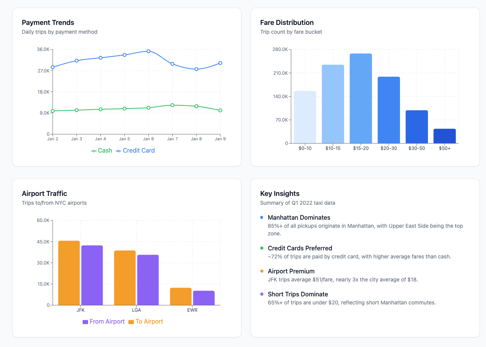
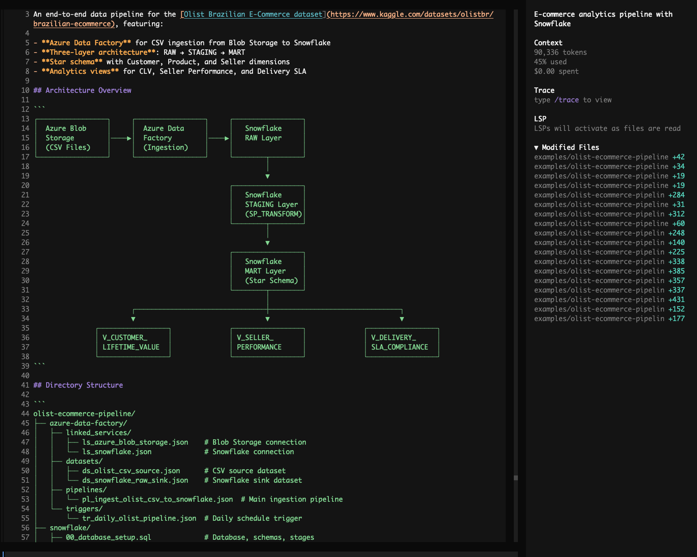
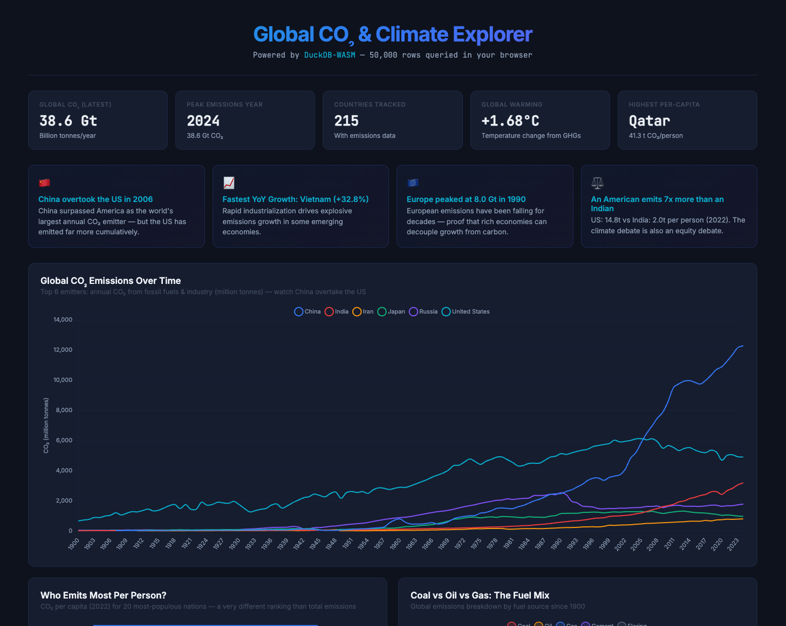
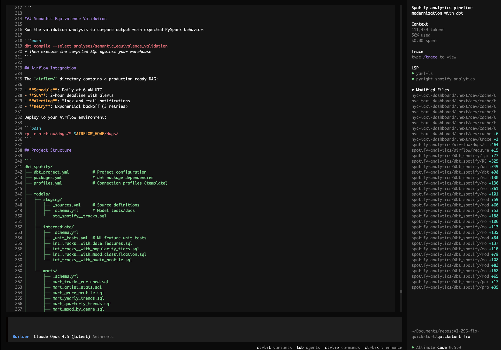
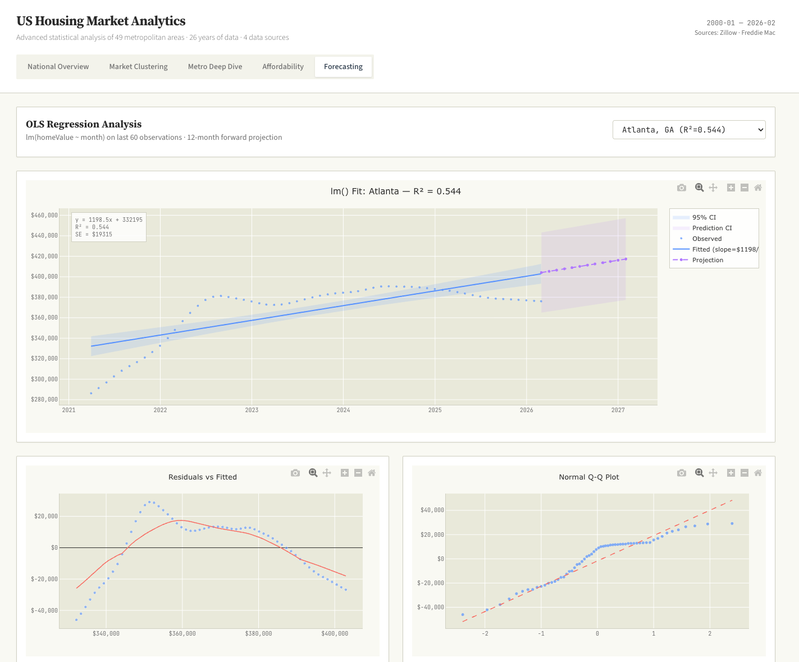
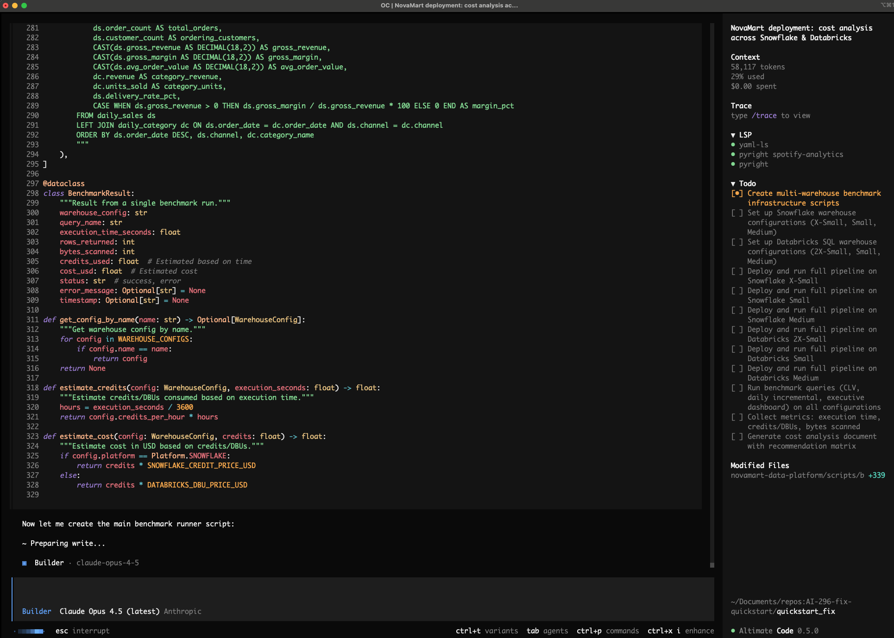

# Showcase

Real-world examples showing what altimate can do across data engineering workflows. Each example demonstrates end-to-end automation — from discovery to implementation.

---

## NYC Taxi Coverage Dashboard

`DuckDB` `dbt` `Airflow` `Python`

**Prompt:**

> Take the New York City taxi cab public dataset, bring up a DuckDB instance, and build a dashboard showing areas of maximum coverage and lowest coverage. Set up a complete dbt project with staging, intermediate, and mart layers, and create an Airflow DAG to orchestrate the pipeline.

---

## Olist E-Commerce Analytics Pipeline

`Snowflake` `Azure Data Factory` `Azure Blob Storage` `dbt`

**Prompt:**

> Build an end-to-end e-commerce analytics pipeline using the Olist Brazilian E-Commerce dataset. Use Azure Data Factory to ingest CSV files from Blob Storage into Snowflake raw tables, then orchestrate Snowflake stored procedures to transform data through raw → staging → mart layers (star schema with customer, product, seller dimensions and orders fact table). Create mart views for customer lifetime value, seller performance scores, and delivery SLA compliance.

---

## Global CO2 & Climate Explorer

`DuckDB-WASM` `SQL` `Browser`

**Prompt:**

> Build me an interactive Global CO2 & Climate Explorer dashboard using DuckDB-WASM running entirely in the browser, sourcing data from Our World in Data's CO2 dataset. Give me surprising insights about who emits the most, how that's changing, the equity angle of per-capita emissions, and which countries bear the most historical responsibility. Include an interactive SQL console with example queries showing off CTEs, window functions (LAG, RANK, SUM OVER), and make it a single index.html with a dark theme.

---

## Spotify Analytics Pipeline Migration

`PySpark` `dbt` `Databricks` `Airflow`

**Prompt:**

> Modernize my Spotify analytics pipeline: use the Kaggle Spotify Tracks public dataset, migrate all PySpark transformations in /spotify-analytics/ to dbt on Databricks/Spark, preserve the ML feature engineering logic (popularity tiers, mood classification, audio profile scores), add schema tests and unit tests, generate an Airflow DAG with SLAs and alerting, and validate semantic equivalence of the outputs.

---

## US Home Sales Data Science Dashboard

`Data Science` `K-Means` `OLS Regression` `R/ggplot2 Aesthetic`

**Prompt:**

> Download all available public US home sales data sets. Process and merge them into a unified format. Perform advanced data science on it to bring to the surface interesting insights. K-means, OLS regressions, and more. Build a single interactive dashboard with data science style charts, think violin plots, Q-Q plots and lollipop charts. Use a R/ggplot2 aesthetic. No BI style charts.

---

## Snowflake vs Databricks Deployment Benchmark

`Snowflake` `Databricks` `Benchmarking` `Cost Analysis`

**Prompt:**

> The NovaMart e-commerce analytics platform in the current directory is ready for deployment. Deploy to both Snowflake and Databricks, testing multiple warehouse sizes on each platform (Snowflake: X-Small, Small, Medium; Databricks: 2X-Small, Small, Medium SQL Warehouses) to find the optimal price-performance configuration. Run the full data pipeline and benchmark queries (CLV calculation, daily incremental, executive dashboard) on each warehouse size, capturing execution time, credits/DBUs consumed, and bytes scanned. Generate a cost analysis document with a recommendation matrix showing cost-per-run for each platform/size combination, and recommend the single best platform + warehouse size for production based on cost efficiency and performance.

